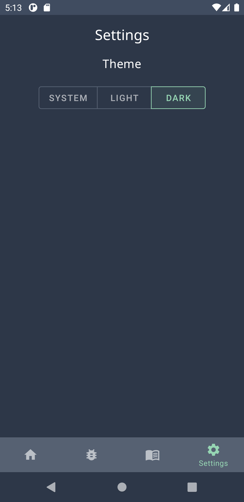

# Damn-Vulnerable-Mobile-App
> An intentionally insecure Android application.

## Table of contents
* [Introduction](#introduction)
* [Features](#features)
* [Screenshots](#screenshots)
* [Status](#status)
* [Contact](#contact)

## Introduction
This project aims to create an intentionally insecure Android app containing the following vulnerabilities:
* Insecure data handling
* Insecure data storage
* Poor authentication
* Improper platform usage

## Features
List of features:
* Contains 4 vulnerability categories all implemented inside the app!
* Contains guides inside the app for each vulnerability
* Light/Dark theme
* Clean interface following Material Design guidelines
* Focus on modern app features such as Jetpack Navigation (1 activity, many fragments approach)

## Screenshots

## Status
Project is: _in progress_

## Contact
Created by [Chris Barker](https://github.com/barkerchris)